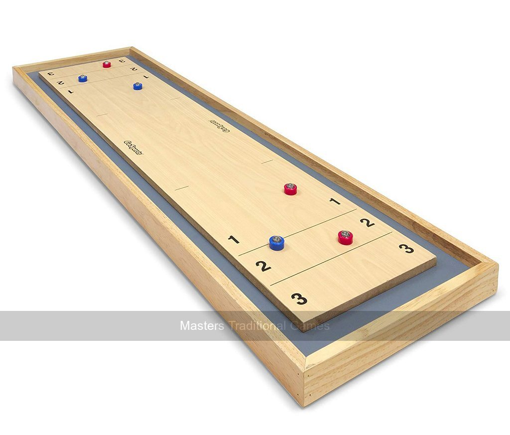

# Shuffleboard

- [Masters of Games](https://www.mastersofgames.com/cat/table/shuffleboard-curling-2-in-1-game.htm)

## Site

- [local](http://localhost:8000/)
- [Published](https://alexhedley.github.io/shuffleboard)

## Run

`py -m http.server`

- [local](http://localhost:8000/)

## License

- [MIT License](LICENSE)
